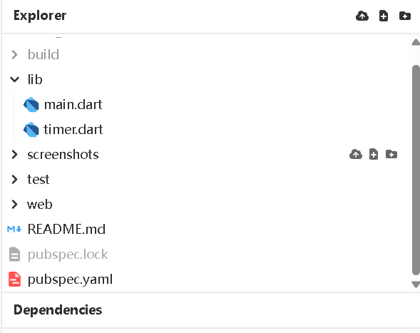
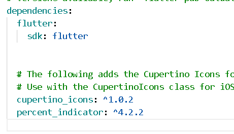
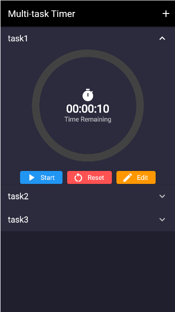
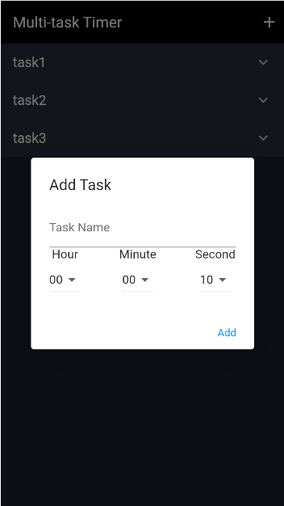
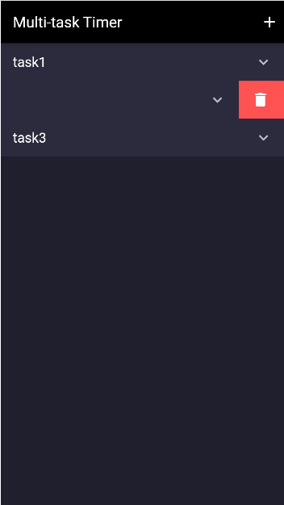

# Flutter Shopping Platform App Demo

This is a mobile timer demo application built with **Flutter** and **Dart**.  
Each task has its own smooth countdown animation, customizable duration, and colorful UI interactions.

---

## Project Structure

 

```
.
├── lib/
│   ├── main.dart        # App entry point
│   └── timer.dart       # Multi-task timer screen & logic
├── screenshots/         # Optional folder for UI screenshots
├── pubspec.yaml         # Dependencies & metadata
├── README.md            # You're reading it!
├── README.doc           # Doc version of readme file


```


## 📦 Dependencies (Changes to pubspec.yaml)

```
dependencies:
  flutter:
  percent_indicator: ^4.2.2

```

## Zapp Url: https://zapp.run/edit/appday86-zldm06laldn0?entry=lib/main.dart&file=lib/timer.dart

## Github Url: https://github.com/tantss333/final_exam.git


## 📲 How to Install and Run the App

**Install Flutter SDK**  
   - [Flutter installation guide](https://flutter.dev/docs/get-started/install)

**Option-1: run on Zapp**
```
https://zapp.run/edit/appday86-zldm06laldn0?entry=lib/main.dart&file=lib/timer.dart
```

**Option-2 Clone github repository:**
   ```
   git clone https://github.com/tantss333/final_exam.git
   cd final_exam
   ``` 

3. **Install dependencies:**
   ```bash
   flutter pub get
   ```

4. **Run the app:**

   - **In Zapp**: run the app on Zapp link directly
   

   - **In IDE**: Be sure that load the project from the root folder, for example: **final_exam**

   - In **Intellij**: click ▶️ next to `main.dart`

   - Or via terminal:
     ```bash
     flutter run
     ```

---

## 🖼 Screenshots


|  |  |
|:--:|:--:|
| Main Page | Add Task Page |

|  |  |
|:--:|:--:|
| Prompt Function | Delete Function |

---

## ✨ Features
✅ Add multiple tasks with custom time (HH:MM:SS)

🎨 Dark-themed UI with colorful action buttons

⭕ Gradient circular countdown indicators

✨ Cool animated popup when a timer finishes

🛠 Edit, start, reset, or delete each task individually

---


## 🎮 How to Use
Tap ➕ to add a new task

Choose hour, minute, and second from dropdowns

Tap ▶️ to start, 🔁 to reset, ✏️ to edit, or swipe to ❌ delete

When time is up, a glowing animated popup will appear

## ⚠ Notes

- Make sure assets are declared in `pubspec.yaml` (e.g. `resource/images/`)
- If you're using a custom folder like `assets/`, update image paths accordingly

---

## 📌 Author

- Student: Sheng Tan  
- Student ID: 1252550